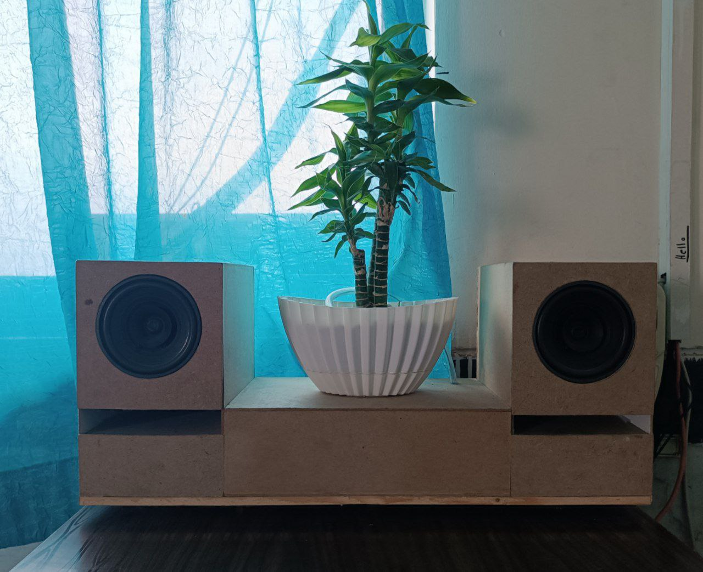
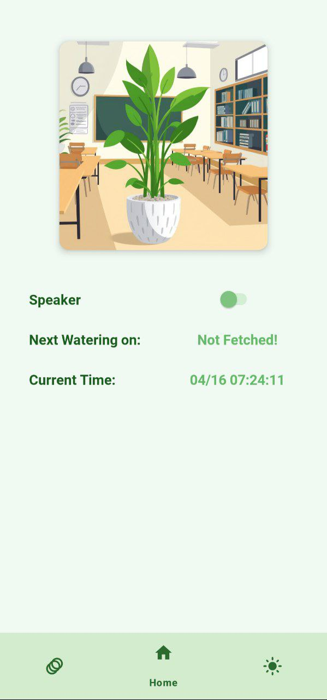
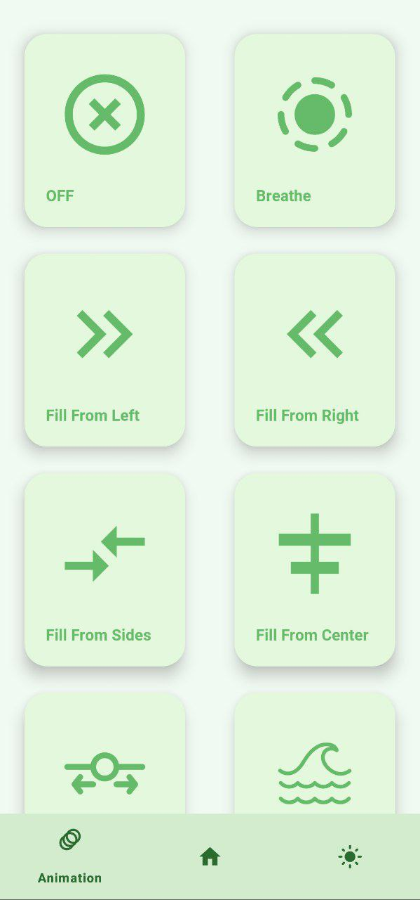
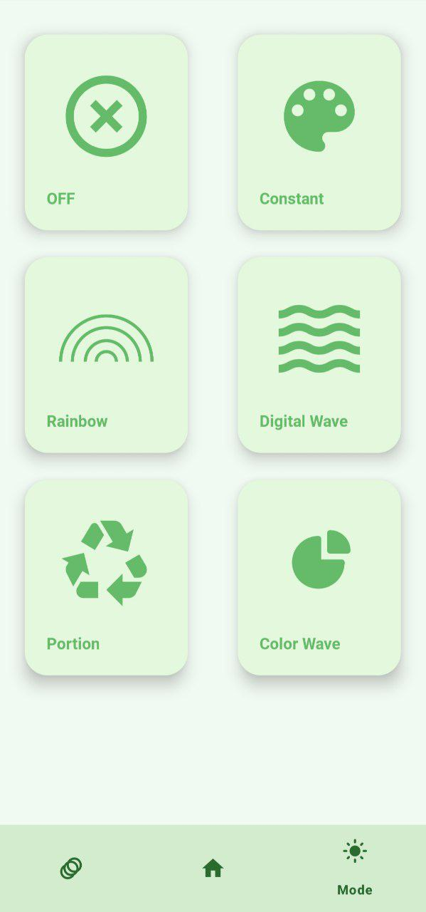

# 🌿 Khosro – Smart IoT Flower Pot

**Khosro** is an ESP32-based smart flower pot built with care by a small team of developers. It features a programmable lighting system, scheduled watering, and integrated Bluetooth audio playback—all controlled through a custom-built Android application.

---

## 📖 The Story Behind Khosro

Khosro started as a small idea shared among a few friends, originally meant to be a simple and compact design. We spent several months brainstorming, refining, and planning the project. The concept was always to include a speaker, but it was never intended to be this large. We initially envisioned it as a small flower pot (or more accurately, a saucer) with some additional features. However, as we progressed and encountered certain limitations, the design grew larger than expected.

It wasn’t until the project was completed that we fully realized what we had created. Khosro wasn’t just a simple design; it felt more like a seed that grew into something much bigger than we had originally envisioned.

---

## 🚀 Features

### 🕒 Automatic Watering
- Scheduled every 8 days (`WATERING_GAP`)
- Watering duration: 3.5 seconds
- RTC (DS1307) handles timekeeping
- Last watering time stored in EEPROM (AT24C32)
- Moisture sensors were removed due to unreliability

### 🎵 Audio via Bluetooth
- Audio is streamed through a **VHM-314 Bluetooth decoder**
- Controlled via ESP32 (GPIO toggle)
- Powered by a **PAM8610 amplifier** for clean audio output

### 💡 LED Lighting System
- 48 WS2812 RGB LEDs controlled by **FastLED**
- Two layers:
  - **Color Layer**: rainbow, digital wave, portioned color, color window, constant, off
  - **Animation Layer**: breathe, fill patterns, sliding/waving, piece-by-piece
- Dynamic control from app or web

### 📱 Android App
- Built in **Android Studio**
- Connects over **ESP32 SoftAP Wi-Fi**
- Features:
  - Clock sync and view
  - Next watering time
  - Lighting control (color + animation)
  - Toggle Bluetooth state

---

## ⚠️ What Didn’t Work (Yet)

Like any creative project, Khosro went through a lot of experimentation—some ideas worked, and others are still on the drawing board:

- **Syncing LED brightness with music**  
  We tried adjusting the LED brightness based on the audio signal to create a music-visualizer-like experience. Unfortunately, it introduced too much noise into the speakers. We had to shelve it for now, but the idea isn't off the table.

- **Mood Based on Soil Moisture**  
  We wanted Khosro to visually express its “mood” (happy or sad) based on soil moisture levels. But due to inconsistent readings from the sensors, we had to remove that feature. We'd love to revisit it with better hardware in the future.

- **Using ESP32 as a Bluetooth Audio Decoder**  
  We initially planned to use the ESP32’s built-in Bluetooth to decode and play audio. However, it turned out the ESP32 didn’t have enough memory to support both the decoding and our main logic. We eventually switched to using a dedicated external decoder (VHM-314) for audio playback.

---

## 🌐 Web Interface & API

ESP32 runs a local HTTP server with endpoints accessible from the app:

| Endpoint                       | Method | Description                            |
|--------------------------------|--------|----------------------------------------|
| `/clock`                       | GET    | Returns current timestamp              |
| `/clock`                       | POST   | Updates internal clock                 |
| `/water`                       | GET    | Returns next watering time             |
| `/water`                       | POST   | Triggers manual watering               |
| `/speaker`                     | GET    | Returns current Bluetooth state        |
| `/speaker`                     | POST   | Toggles Bluetooth decoder              |
| `/led/color/<mode>`            | POST   | Sets color mode                        |
| `/led/mode/<animation>`        | POST   | Sets animation mode                    |

> Modes include parameters like `duration`, `n`, `rtl`, and hex color values passed as query parameters.

---

## 🛠️ Hardware

| Component                  | Purpose                      |
|----------------------------|------------------------------|
| **ESP32**                  | Main controller              |
| **DS1307 RTC**             | Timekeeping                  |
| **AT24C32 EEPROM**         | Store last watering time     |
| **WS2812 RGB LEDs (x48)**  | Lighting system              |
| **Kitronik 25110 Pump**    | Automated watering           |
| **VHM-314 BT Decoder**     | Bluetooth audio input        |
| **PAM8610 Amplifier**      | Powers external speaker      |

---

## 💻 Tech Stack

- **Firmware**: C++ with PlatformIO
- **App**: Android Studio
- **Lighting**: FastLED
- **Web Interface**: Arduino `WebServer` + `DNSServer`
- **Storage**: I²C EEPROM (AT24C32)
- **Audio**: VHM-314 + PAM8610

---

## 📸 Gallery

### Final Build

### Lighting & Audio Demo (GIF)

### LED Testing During Build (GIF)

---

### Android App Preview

| Home Screen | Animation Settings | Mode Selection |
|-------------|--------------------|----------------|
|  |  |  |

> Want your version featured here? [Send us photos!](#share-your-khosro)

---

## 📷 Share Your Khosro!

Have you built your own version of Khosro or used our code as inspiration for your own project? We’d love to see it!

Feel free to share pictures, videos, or your own custom modifications by opening an issue or submitting a pull request to add it to the gallery. You can also tag me on GitHub or reach out directly.

Let’s grow the Khosro community together!

---

## 🧠 Authors & Credits

**Khosro** was built by a dedicated team of friends:

- [Parsa Karimi](https://github.com/ParsaKarimi)
- Roham Ahmadpoor
- Ashkan Karimi
- Avesta Nooshirvanpoor
- Kian Soleimani

Thank you to everyone who contributed their time, creativity, and effort to bring this project to life!

---

## 📜 License

MIT License. See `LICENSE` for more details.
